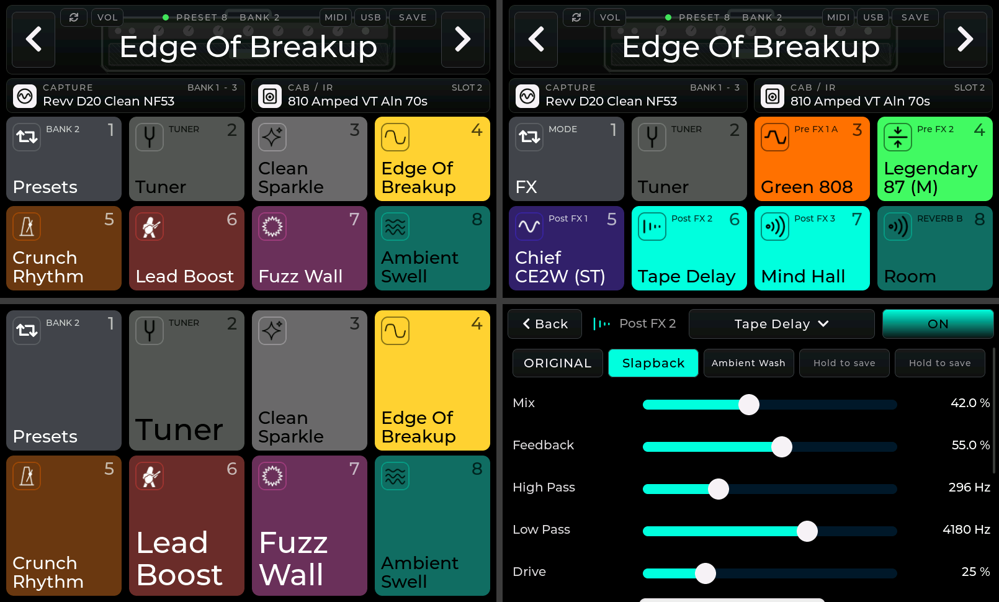
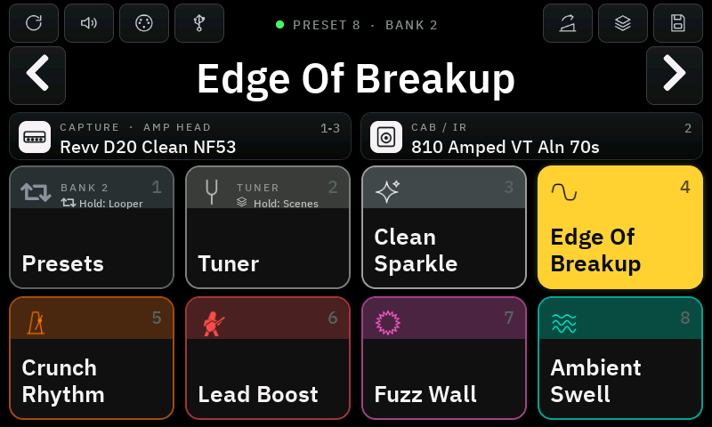
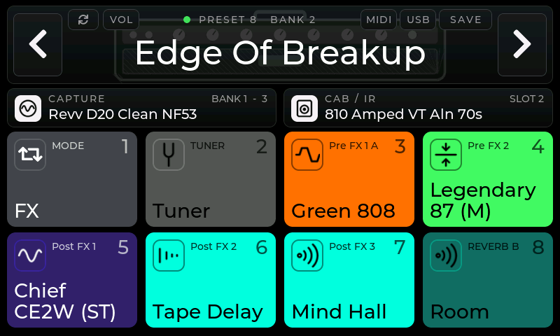
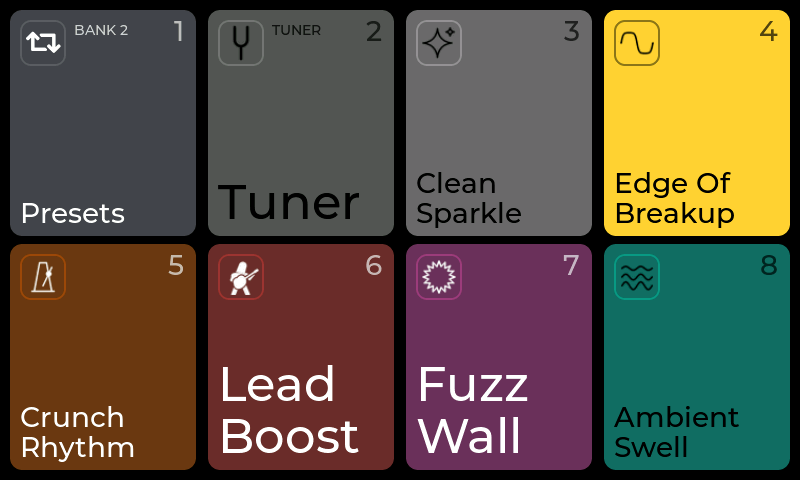

# Nano Cortex Controller (unofficial)




A touch screen and footswitch controller for the **Neural DSP Nano Cortex**, connected over Bluetooth.
It runs on a **Waveshare ESP32-S3-Touch-LCD-4.3** and turns it into a Quad-Cortex-style floor controller:
eight coloured tiles for eight footswitches, a full FX editor, the capture and IR library, a tuner and
your own preset banks. It is the hardware companion of the
[Nano Cortex Editor](https://github.com/DrD85/nano-cortex-editor).

> **Unofficial community project.** Not affiliated with, endorsed by or supported by Neural DSP.
> "Nano Cortex", "Quad Cortex" and "Neural DSP" are trademarks of Neural DSP Technologies.
> The controller writes to your device. Use it at your own risk and keep backups of your presets
> (for example with the official Cortex Cloud app).

**Deutsch:** [Anleitung auf Deutsch](README.de.md)



## Features

- **Presets**: six presets per bank on footswitches 3–8, 16 own banks with colour and symbol per switch,
  previous/next preset by swiping, rename and save on the Nano, follows preset changes made on the pedal
- **FX mode**: footswitches 3–7 switch Pre FX 1–2 and Post FX 1–3, tiles in the effect category colours
- **Second effect on Pre FX 1**: footswitch 3 short = on/off, held = swap to a second effect (e.g. an auto-wah)
- **FX editor** (long press on an FX tile): choose the model and edit every parameter live, with four named
  **FX presets** per effect model
- **Capture and Cab/IR**: pick one of the 25 capture slots or 5 cab slots, or load any capture or IR from the
  Nano's library (factory and user) into the active slot
- **Capture volume** (VOL) and **cab settings** (long press on the cab card: output, high pass, low pass)
- **Reverb switch** (footswitch 8): toggles the reverb mix between Pos 1 and Pos 2 of the preset's expression
  setting – or switches between the preset's reverb and a **second reverb** with its own settings
- **Tuner** with large note display and needle (footswitch 2)
- **USB audio volume** of the Nano (playback from the computer), as in the official app
- **App bridge**: the Nano Cortex Editor (Mac app or browser) can connect through the controller while the controller
  is connected to the Nano – app and controller work at the same time
- **Bluetooth MIDI**: connect a MIDI controller wirelessly – for example a Morningstar MC6 with a WIDI adapter –
  using the Nano's own MIDI messages (program change, CC 37–41, CC 1)
- **Footswitch learn**: assign any footswitch to any function
- **Full-screen tiles** (swipe up) for reading from a distance
- Up to 8 footswitches on an SX1509 I/O expander (optional – the touch screen works on its own)

## Screenshots

| | |
|---|---|
|  |  |
| FX mode | Full-screen tiles (swipe up) |
|  |  |
| FX editor | Own banks: colour, symbol and preset |
|  |  |
| Capture library | Reverb switch: second reverb |
|  |  |
| Tuner | USB audio volume |
|  |  |
| Bluetooth MIDI | Capture volume |
|  |  |
| Cab settings (long press on the cab card) | Second effect on Pre FX 1 (2ND in its FX editor) |

The screenshots show example presets. They are rendered from the firmware's own UI code
(`tools/screenshots/make_screenshots.sh`).

## What you need

| Part | Notes |
|---|---|
| [Waveshare ESP32-S3-Touch-LCD-4.3](https://www.waveshare.com/wiki/ESP32-S3-Touch-LCD-4.3) | 800 × 480 touch screen, version with two USB-C ports (**USB** and **UART**) |
| Neural DSP Nano Cortex | Bluetooth on; no pairing needed |
| Optional: SX1509 breakout + up to 8 momentary footswitches | see [Footswitches](#footswitches) |

## Install the firmware (in the browser, no tools needed)

The firmware is on the [Releases](../../releases) page. Each release has two files:

| File | Flash at | Use it for |
|---|---|---|
| `nano-controller-<version>-full.bin` | `0x0` | the **first installation** (bootloader, partition table and app). Erases stored banks and settings. |
| `nano-controller-<version>-update.bin` | `0x10000` | **updates**: only the app – your banks, symbols, footswitch order and second reverbs stay |

1. Open **[esptool.spacehuhn.com](https://esptool.spacehuhn.com)** in **Chrome** or **Edge** on a computer
   (Safari and Firefox have no Web Serial).
2. Connect the board with the USB-C port labelled **USB** (not UART).
3. Click **Connect** and choose the port of the board (usually "USB JTAG/serial debug unit").
   If no port shows up: hold the **BOOT** button, press and release **RESET**, then release **BOOT** and try again.
4. Add the `.bin` file and set the address: `0x0` for the `-full.bin`, `0x10000` for the `-update.bin`.
5. Click **Program** and wait until it says it is done.
6. Press **RESET** on the board (or unplug and plug it in again).

The checksums of both files are in `nano-controller-<version>-sha256.txt`.

## First start

1. Switch the Nano Cortex on.
2. Close the **Cortex Cloud** app and the **Nano Cortex Editor** – the Nano accepts only one Bluetooth
   connection at a time.
3. Power the board. It searches for the Nano ("SEARCHING FOR THE NANO…"), connects, reads all preset names and
   shows the current preset. If it does not find the Nano within a minute, switch the Nano off and on again.

## Using it

### The screen

```
┌──────────────────────────────────────────────────────────┐
│  ◀  ↻  VOL   ● PRESET 7   BANK 2   MIDI   USB   SAVE   ▶  │  preset card: arrows = bank −/+
│              Revv NF53 Clean                              │  long press on the name: rename
├────────────────────────────┬─────────────────────────────┤
│ CAPTURE  Revv D20 clean    │ CAB / IR  810 Amped VT      │  tap: choose slot or library item
│                            │                             │  long press: capture volume / cab settings
├──────────┬──────────┬──────┴───┬──────────────────────────┤
│ 1 MODE   │ 2 TUNER  │ 3        │ 4                        │  eight tiles = eight footswitches
├──────────┼──────────┼──────────┼──────────────────────────┤
│ 5        │ 6        │ 7        │ 8                        │
└──────────┴──────────┴──────────┴──────────────────────────┘
```

- **Tap a tile** = press its footswitch.
- **↻** (top left) reads everything from the Nano again: preset names, the current preset and the library.
- **VOL** next to it sets the capture volume of the current preset.
- **Swipe left / right**: next / previous preset.
- **Swipe up**: tiles in full screen (larger names). **Swipe down**: back.
- The green dot shows the Bluetooth connection to the Nano; **SAVE** turns orange when the preset has unsaved
  changes. **MIDI** turns green while a Bluetooth MIDI controller is connected.

### Footswitches and tiles

| Switch | Preset mode | FX mode |
|---|---|---|
| 1 | switch to FX mode | switch to preset mode |
| 2 | tuner on/off | tuner on/off |
| 3–8 | the six presets of the current bank | 3–7: Pre FX 1, Pre FX 2, Post FX 1–3 on/off |
| 8 | (sixth preset) | reverb: mix Pos 1 ↔ Pos 2, or reverb A ↔ B |

Active tiles light up in full colour, inactive ones are dimmed. FX tiles use the effect category colours.

### Long presses

| Where | What opens |
|---|---|
| Tile 1 or 2 | **Learn** for this footswitch (see below) |
| Preset tile (3–8, preset mode) | **Bank editor**: colour, symbol and preset of this switch; `DEFAULT` restores the standard preset; `LEARN SWITCH` |
| FX tile (3–7, FX mode) | **FX editor**: model (tap the model name), on/off and all parameters |
| Tile 8 (FX mode) | **Reverb dialog** with the tabs *MIX POS 1 / 2* and *2ND REVERB* |
| Preset name | **Rename** with on-screen keyboard (at least 4 characters, unique) |

### Own banks

16 banks with six switches each. By default bank 1 holds presets 1–6, bank 2 presets 7–12 and so on.
A long press on a preset tile lets you choose any preset, one of ten colours and one of 19 symbols
(Clean, Edge, Drive, Solo, Fuzz, Atmospheric, Metal, Boost, Rhythm, Bass, Acoustic, Blues, Live, Favorite,
Fuzz Wave, Guitarist, Rocket, Space, Swell).
The banks are stored on the controller, the presets themselves stay on the Nano.

### Capture and Cab/IR

Tap the CAPTURE or CAB / IR card. **SLOTS** lists the 25 capture slots (5 banks × 5) or 5 cab slots;
**LIBRARY** shows all captures or IRs stored on the Nano with category filters (AMP = head or combo, AMP+CAB, CAB, PEDAL, OTHER).
A library item is loaded into the active slot after a confirmation.

**Capture volume**: **VOL** in the preset card or a long press on the CAPTURE card, −24 dB to +12 dB
(**0 dB** resets). **Cab settings**: a long press on the CAB / IR card – **OUTPUT** (−96 dB to +12 dB),
**HIGH PASS** (20–800 Hz) and **LOW PASS** (1–20 kHz) of the active cab, read from the Nano when the dialog opens.
Both are part of the preset: changes are heard at once, **SAVE** keeps them.

### FX editor

Changes are sent to the Nano while you move a control. The Nano only reports parameter values of effects that
are switched on – switch an effect on to see and edit its values. **SAVE** in the preset card stores the preset
on the Nano.

**FX presets** (the row above the parameters): four named settings per effect model, stored on the controller and
usable in every preset and slot with that model.

- **Hold** a place: the keyboard opens and the current settings are saved under the name you type. An empty name
  deletes the place.
- **Tap** a place: its settings are loaded at once.
- **ORIGINAL** goes back to the settings the effect had when you opened the editor. Right after choosing a new
  model, these are the model's defaults.

Loaded settings count as changes to the Nano preset: **SAVE** keeps them there.

### Reverb switch (footswitch 8)

- **MIX POS 1 / 2**: footswitch 8 sets the reverb's Mix to Pos 1 or Pos 2. These are the heel and toe values of
  the preset's expression setting for the reverb ("Post FX 3 Amount"). Moving a slider plays that mix;
  **SAVE** writes both values into the preset (and creates the expression setting if there is none).
- **2ND REVERB**: choose a second reverb (B) for this preset. Footswitch 8 then switches between the preset's
  reverb (A) and B; the Nano has one reverb slot, so the controller swaps the model and sends the stored values
  (takes about half a second). Tile 8 shows reverb B and lights up while it runs; tile 7 shows the reverb in the slot. **EDIT B** loads B and opens the FX editor to set it up. Reverb B is stored on the
  controller, per preset. If you save the preset while B is active, B becomes the preset's reverb.

### Second effect on Pre FX 1 (footswitch 3)

Long press on the Pre FX 1 tile, then **2ND** in the FX editor: choose a second effect (B) for this preset, for
example the Envelope Filter as an auto-wah next to a drive. Then footswitch 3 in FX mode:

- **short press**: the effect in the slot on / off (it acts when you lift your foot)
- **hold** (0.6 s): swap A ↔ B – the other effect comes in, switched on

The tile shows *Pre FX 1 A* or *Pre FX 1 B*. The Nano has one model per slot, so the controller swaps the model and
sends the stored values of the other effect: this takes about half a second with a short gap in the sound.
For a gapless change put the second effect into a free slot instead and switch it on and off.
B is edited in the FX editor while it runs and is stored on the controller, per preset (MIDI: CC 58).

### Tuner

Footswitch 2 or the TUNER tile. Shows the note, the deviation in cents and a needle (green = in tune).
Tap the screen or press footswitch 2 again to close it.

### USB audio volume

**USB** in the preset card: volume of the audio played from the computer over USB, −40 dB (OFF) to 0 dB,
as in the official app. The value is read from the Nano each time.

### Bluetooth MIDI

**MIDI** in the preset card opens the device list. It shows Bluetooth MIDI devices nearby – for example a
CME WIDI adapter on the MIDI port of a Morningstar MC6, or a Bluetooth MIDI
footswitch. Tap one to connect it; the controller remembers it and connects again by itself whenever it is
switched on. **FORGET DEVICE** disconnects and forgets it. The Nano stays connected at the same time.

The controller understands the same messages as the Nano's own MIDI over USB, on all MIDI channels, so banks made
for the Nano (for example with the MC6 export of the Nano Cortex Editor) work over Bluetooth too:

| Message | Action |
|---|---|
| Program Change 0–63 | preset 1–64 |
| CC 37–41 | FX slot 1–5 (Pre FX 1, Pre FX 2, Post FX 1–3): value 64–127 on, 0–63 off |
| CC 1 | expression: reverb mix from Pos 1 (0) to Pos 2 (127) |
| CC 50–57, value 64–127 | press footswitch 1–8 (mode, tuner, presets or FX, reverb switch) |
| CC 58, value 64–127 | hold footswitch 3: Pre FX 1 swaps to its second effect and back |

A wired MIDI input is not possible on this board without extra hardware; use a Bluetooth MIDI adapter instead.

### Nano Cortex Editor through the controller

The Nano accepts only one Bluetooth connection. When the controller is connected to the Nano, it offers itself as
**"Nano Cortex Controller"** with the same Bluetooth service as the Nano, so the
[Nano Cortex Editor](https://github.com/DrD85/nano-cortex-editor) connects to the controller instead:
**app ↔ controller ↔ Nano**. The Mac app picks it automatically; in the browser choose "Nano Cortex Controller".
Without the controller (or before it has connected) the app connects to the Nano directly, as before.

- Everything the app sends goes on to the Nano; replies to the app's requests go back to the app, replies to the
  controller's own requests stay on the controller, and messages the Nano sends on its own reach both.
- Changes made in the app appear on the controller a moment later; changes made on the controller (footswitches,
  touch, MIDI) make the app read the preset again, as after a change on the pedal.
- While the app is connected, **APP** is shown in the status line.

### Footswitch learn

Long press on tile 1 or 2, or **LEARN SWITCH** in the bank editor. Then press the footswitch that should have
this function within 15 seconds. If it had another function, the two are swapped. **DEFAULT ORDER** restores
the standard order.

### What is stored where

| On the Nano | On the controller |
|---|---|
| presets, names, captures, cabs, FX and their values, expression settings (Pos 1 / Pos 2), USB volume | own banks (preset, colour, symbol), footswitch order, second reverbs, the Bluetooth MIDI device |

## Footswitches

The footswitches are read by an **SX1509** I/O expander (for example the SparkFun breakout), as in
[TonexOneController](https://github.com/Builty/TonexOneController).

- Connect the SX1509 to the board's **I2C** bus: SDA = GPIO 8, SCL = GPIO 9, 3.3 V and GND
  (see Waveshare's wiki for the connector of your board).
- Set the SX1509 address to **0x71** (or 0x70). 0x3E/0x3F are taken by the board's own I/O expander.
- Wire each footswitch (momentary, normally open) between an SX1509 I/O pin and **GND**. Internal pull-ups are
  used, no resistors needed.
- Default order: switch 1–8 on SX1509 pins **11, 10, 0, 1, 2, 3, 8, 9**. Any other pins work too – use
  footswitch learn to assign them.

Without an SX1509 the controller works with the touch screen only.

## Serial console

With the board on the **USB** port, any serial monitor at 115200 baud (for example `idf.py monitor --no-reset`)
shows a log of all messages and accepts commands: `n`/`p` next/previous preset, a number (1–64) selects a preset,
`a`–`e` switch FX slots 1–5, `m` mode, `t` tuner, `x` reverb switch, `s` read the preset again, `r` read everything again,
`l` list the preset names, `h` help.

## Build from source

Requirements: [ESP-IDF](https://docs.espressif.com/projects/esp-idf/) **v6.0.2**. The components (LVGL, display
port, touch driver) are downloaded by the component manager on the first build.

```bash
. ~/esp/esp-idf/export.sh
idf.py build
idf.py -p /dev/cu.usbmodem1101 flash
idf.py -p /dev/cu.usbmodem1101 monitor --no-reset
```

Open the monitor with `--no-reset`; otherwise the reset over the native USB port can leave the board in
download mode. Use the port name of your system (`ls /dev/cu.*` on a Mac).

`tools/release.sh` builds the release files (`release/…-full.bin` and `…-update.bin`) as published.

### Project layout

| Path | Contents |
|---|---|
| `main/main.c` | app task: events from Bluetooth, touch screen, footswitches and console; modes, banks, FX editor, reverb switch |
| `main/nano_link.c` | Bluetooth LE central (NimBLE): scan, connect, MTU 517, notifications, reassembly of long messages, write queue |
| `main/nano_state.c` | protobuf parsing of the Nano's state and all request messages |
| `main/library.c` | capture / IR library (reading, sorting, loading into a slot) |
| `main/midi_ble.c` | Bluetooth LE MIDI client: device list, connection, BLE MIDI packets |
| `main/app_link.c` | app bridge: Nano service (A002 / C304 / C305) for the editor, packets as the Nano sends them |
| `main/ui.c` | LVGL user interface |
| `main/board.c` | display (RGB 800 × 480), GT911 touch, CH422G I/O expander, LVGL port |
| `main/footswitches.c` | SX1509 polling, debouncing, learn |
| `main/fx_models.c`, `main/fx_icons.c`, `main/preset_icons.c` | generated tables and icons (see `tools/`) |
| `tools/gen_tables.py` | FX models and parameters (`tools/editor_models.json`, exported from the editor) and effect icons |
| `tools/preset_icons.py` | the preset symbols (own drawings), rendered by `tools/svg_render.py` |
| `tools/gen_pedals.py` | optional pedal pictures for an own build (see below) |
| `tools/screenshots/` | renders the screenshots in `docs/images` on the computer from `main/ui.c` with example data |

### Own artwork (optional, own builds only)

`main/fx_icons.c` contains drawn effect icons and `main/fx_pedals.c` no pedal pictures. If you have your own icon
set or pedal pictures, `tools/gen_tables.py` and `tools/gen_pedals.py` can turn them into
`main/private/fx_icons_private.c` and `main/private/fx_pedals_private.c`: the build uses them automatically, they
are ignored by git and never part of the published firmware (`-DNANO_PUBLIC=1`). Do not publish artwork you have
no rights to.

## How it works

The Nano Cortex offers a Bluetooth LE service `A002` with a write characteristic `C304` and a notify
characteristic `C305`. Every message is a protobuf payload framed as
`[length] C0 [payload] [32-bit little-endian message type]`; long replies are split into several packets.
The controller is a Bluetooth central: it connects without pairing, requests an MTU of 517 and reads the full
state (all preset names) once, then the current preset after every change.

Message types used (request → reply): 1 → 2 state, 3 save, 28 capture/cab slot, 29 → 30 preset change,
26 capture volume, 31 FX on/off, 60 → 61 and 62 expression settings, 65 → 66 and 67 → 68 settings, 76 → 77 library,
78 → 79 / 80 → 81 load IR / capture, 94 cab setting, 95 → 96 cab settings, 99 FX parameter, 111 → 112 rename, 115 unsaved changes,
127 / 128 tuner, 136 FX model, 137 → 138 FX parameter values. The message layouts are documented in the
comments of `main/nano_state.c`, `main/library.c` and in the
[Nano Cortex Editor](https://github.com/DrD85/nano-cortex-editor).

For the app bridge the controller is also a Bluetooth peripheral with the Nano's service. Replies carry no request
id, so every request with a known reply type is noted with its sender (controller or app); the Nano answers in
order, and each reply goes to the sender of the oldest open request of its type. Long replies are split for the app
exactly as the Nano does: `[length low] [0x40 first | 0x80 last | length high] data`, up to 510 bytes per packet.

Bluetooth MIDI runs on a second connection next to the Nano: the controller looks for the BLE MIDI service
(`03B80E5A-EDE8-4B33-A751-6CE34EC4C700`), subscribes to its characteristic and decodes the BLE MIDI packets
(timestamps, running status) into channel messages.

When the preset is changed on the pedal, the Nano sends message 29 and waits for the acknowledgement 30
(`06 C0 20 01 1E 00 00 00`); the controller answers it and reads the new preset.

## Credits

This project stands on the shoulders of:

- [Nano Cortex Editor](https://github.com/DrD85/nano-cortex-editor) (MIT) – the Bluetooth protocol as tested
  against the device, the FX model and parameter tables and the effect icon drawings
- [rixrix/deskop-nano-cortex](https://github.com/rixrix/deskop-nano-cortex) (Apache-2.0) – protocol notes on the
  state layout and the preset-change acknowledgement (via the editor)
- [Builty/TonexOneController](https://github.com/Builty/TonexOneController) (Apache-2.0) – the idea of a touch
  screen controller on this Waveshare board, its display and touch setup (pins, timing, touch reset) and the
  SX1509 footswitch wiring
- [ESP-IDF](https://github.com/espressif/esp-idf) (Apache-2.0) by Espressif, including the
  [NimBLE](https://github.com/apache/mynewt-nimble) Bluetooth stack (Apache-2.0)
- [LVGL](https://github.com/lvgl/lvgl) (MIT) – the graphics library, including TinyTTF with
  [stb_truetype](https://github.com/nothings/stb) (MIT / public domain)
- [esp_lvgl_port](https://components.espressif.com/components/espressif/esp_lvgl_port),
  [esp_lcd_touch](https://components.espressif.com/components/espressif/esp_lcd_touch) and
  [esp_lcd_touch_gt911](https://components.espressif.com/components/espressif/esp_lcd_touch_gt911)
  (Apache-2.0) by Espressif
- [Montserrat](https://github.com/JulietaUla/Montserrat) font (SIL Open Font License 1.1) by
  The Montserrat Project Authors – the built-in LVGL fonts and the large tuner note
- [ESPWebTool](https://github.com/SpacehuhnTech/espwebtool) (MIT) by Spacehuhn – flashing in the browser
- [esptool](https://github.com/espressif/esptool) (GPL-2.0) by Espressif – flashing and release images
- [Pillow](https://github.com/python-pillow/Pillow) (MIT-CMU) – rendering the icons in `tools/`
- [Waveshare](https://www.waveshare.com/wiki/ESP32-S3-Touch-LCD-4.3) – board documentation and demos

## License

[MIT](LICENSE) for the code of this project. The components above keep their own licenses.
