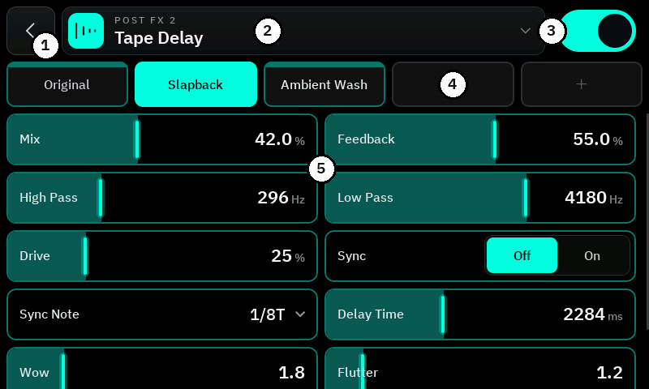

# Nano Cortex Controller (unofficial)

A touch screen and footswitch controller for the **Neural DSP Nano Cortex**. It runs on a
**Waveshare ESP32-S3-Touch-LCD-4.3**, connects over Bluetooth and works like a small Quad Cortex floor unit:
eight tiles for eight footswitches, your own preset banks, an FX editor, the capture and IR library, a tuner and
a looper mode. It is the hardware companion of the [Nano Cortex Editor](https://github.com/DrD85/nano-cortex-editor).

**Deutsch:** [Anleitung auf Deutsch](README.de.md) · **No board yet?** The same firmware runs in the browser:
[Nano Cortex Controller Web](https://github.com/DrD85/nano-cortex-controller-web)

> **Unofficial community project.** Not affiliated with, endorsed by or supported by Neural DSP.
> "Nano Cortex", "Quad Cortex" and "Neural DSP" are trademarks of Neural DSP Technologies.
> The controller writes to your device. Use it at your own risk and keep backups of your presets
> (for example with the official Cortex Cloud app).

## What it can do

- **Presets and banks** – six presets per bank on footswitches 3–8, 16 banks with your own colours and symbols
- **FX mode** – switch the five FX slots with your feet, plus a reverb switch and a second effect on Pre FX 1
- **FX editor** – choose models and set every parameter on the touch screen, with named FX presets
- **Capture and Cab/IR** – pick slots or load anything from the Nano's library; capture tone, volume, cab settings
- **Tuner**, **gig view** with large tiles, **Bluetooth MIDI** for an extra controller
- **Looper mode** – the footswitches control a looper app on a phone (for example Loopy Pro)
- The [Nano Cortex Editor](https://github.com/DrD85/nano-cortex-editor) can connect **through** the controller

## Get started

**1. What you need**

| Part | Notes |
|---|---|
| [Waveshare ESP32-S3-Touch-LCD-4.3](https://www.waveshare.com/wiki/ESP32-S3-Touch-LCD-4.3) | 800 × 480 touch screen, version with ONE USB-C port (**USB**) |
| Neural DSP Nano Cortex | Bluetooth on; no pairing needed |
| Optional: SX1509 breakout + up to 8 momentary footswitches | [wiring](docs/manual.md#footswitches) – the touch screen works on its own |

**2. Install the firmware** – in the browser, no tools needed. The files are on the [Releases](../../releases) page.

1. Open **[esptool.spacehuhn.com](https://esptool.spacehuhn.com)** in **Chrome** or **Edge** and connect the board
   with the USB-C port labelled **USB**.
2. Click **Connect** and choose the board (usually "USB JTAG/serial debug unit"). No port? Hold **BOOT**, press and
   release **RESET**, release **BOOT**, try again.
3. Add the file and its address, then click **Program**:

   | File | Address | Use it for |
   |---|---|---|
   | `nano-controller-<version>-full.bin` | `0x0` | the **first installation** (erases stored banks and settings) |
   | `nano-controller-<version>-update.bin` | `0x10000` | **updates** – your banks and settings stay |

4. Press **RESET** on the board.

**3. First start** – switch the Nano on, close the Cortex Cloud app and the Nano Cortex Editor (the Nano accepts
only one Bluetooth connection) and power the board. It finds the Nano, reads the presets and shows the current one.
If it does not find the Nano within a minute, switch the Nano off and on again.

## How to use it

### The main screen

1. **↻** read everything again · **speaker** capture volume · **MIDI** devices · **USB** audio volume
2. Green dot = connected to the Nano; preset and bank
3. **Save** the preset on the Nano – green when there are unsaved changes
4. Previous / next **bank**
5. Preset name – **hold** to rename
6. Capture and cab – **tap** to choose, **hold** for tone / cab settings
7. Eight tiles = eight footswitches. **Tap** a tile = press its switch

A tile is **filled** when it is active (the loaded preset, an effect that is on) and dark with its colour along the
top when it is not. **Swipe left / right** for the next / previous preset.

### Presets and FX

<table>
<tr>
<td width="50%"></td>
<td width="50%"></td>
</tr>
<tr>
<td>

**Preset mode** – tiles 3–8 are the six presets of the bank. **Hold** a tile to give that switch another preset,
a colour and a symbol.

</td>
<td>

**FX mode** – tiles 3–7 switch Pre FX 1–2 and Post FX 1–3, tile 8 is the reverb switch. **Hold** a tile to open
its editor.

</td>
</tr>
</table>

**Footswitch 1** changes between the two modes, **footswitch 2** is the tuner.

### Gig view

<table>
<tr>
<td width="50%"></td>
<td>

**Swipe up**: the tiles fill the screen with large names, and a slim bar shows connection, preset, bank, unsaved
changes and the mode. **Swipe down**: back.

</td>
</tr>
</table>

### FX editor

**Hold an FX tile** to open it.

1. Back
2. **Tap** to choose another model. The symbol is filled when the effect is on
3. Effect on / off
4. **FX presets**: tap = load, **hold** = save the current settings under a name
5. **Slide sideways** on a bar to change a value; up and down scrolls

Values are shown while the effect is on. *Off | On* settings switch with a tap. More: [manual](docs/manual.md#fx-editor).

### Capture, cab and tuner

<table>
<tr>
<td width="33%"></td>
<td width="33%"></td>
<td width="33%"></td>
</tr>
<tr>
<td>

**Tap** the capture or cab card: the Nano's slots, or its whole library with filters.

</td>
<td>

**Hold** the capture card for gain, bass, mid and treble – the cab card for output, high and low pass.

</td>
<td>

**Footswitch 2** opens the tuner, with reference pitch and output mute. Tap to close.

</td>
</tr>
</table>

### Looper mode

<table>
<tr>
<td width="50%"></td>
<td>

**Hold footswitch 1**: the tiles become the switches of a looper app on a phone, for example Loopy Pro playing
through the Nano. Any press of footswitch 1 goes back.

- In the app connect the Bluetooth device *Nano Cortex Controller* and bind the switches with MIDI Learn
- **Hold** a tile to change its name, colour and symbol

Setup step by step: [manual](docs/manual.md#looper-mode-a-looper-app-on-a-phone).

</td>
</tr>
</table>

### Touch and footswitches at a glance

| Do this | Where | What happens |
|---|---|---|
| **Tap** | a tile | the same as its footswitch |
| **Hold** | a preset tile | bank editor: preset, colour and symbol of this switch |
| | an FX tile | FX editor |
| | tile 8 in FX mode | reverb switch: mix positions or a second reverb |
| | tile 1 | looper mode on / off |
| | a looper tile | its name, colour and symbol |
| | tile 2 | learn which footswitch is which |
| | the preset name | rename the preset |
| | capture / cab card | capture tone / cab settings |
| **Swipe** left / right | anywhere | next / previous preset |
| **Swipe** up / down | anywhere | gig view on / off |
| **Footswitch 1** | | short: presets ↔ FX · held: looper mode |
| **Footswitch 2** | | tuner |
| **Footswitch 3** held | FX mode | Pre FX 1 swaps to its second effect |

## More

- **[Manual](docs/manual.md)** – every function in detail: banks, capture and cab, FX presets, reverb switch, second
  effect, [Bluetooth MIDI](docs/manual.md#bluetooth-midi) with all messages, looper mode, the editor through the
  controller, [footswitch wiring](docs/manual.md#footswitches), what is stored where
- **[Development](docs/development.md)** – build from source, project layout, serial console, how the controller talks
  to the Nano
- **[Web version](web/README.md)** – how the browser build is made

The screenshots show example presets and are rendered from the firmware's own UI code
(`tools/screenshots/make_screenshots.sh`).

## Credits

Built on the [Nano Cortex Editor](https://github.com/DrD85/nano-cortex-editor) (protocol, FX tables),
[rixrix/deskop-nano-cortex](https://github.com/rixrix/deskop-nano-cortex) (protocol notes),
[Builty/TonexOneController](https://github.com/Builty/TonexOneController) (the idea, display and footswitch setup),
[ESP-IDF](https://github.com/espressif/esp-idf) with NimBLE, [LVGL](https://github.com/lvgl/lvgl) and
[IBM Plex Sans](https://github.com/IBM/plex). The full list with licenses: [docs/credits.md](docs/credits.md).

## License

[MIT](LICENSE) for the code of this project. The components above keep their own licenses.
