# Nano Cortex Controller – Handbuch

Alle Funktionen im Detail. Die kurze bebilderte Anleitung steht im [README](../README.de.md); wie die Firmware gebaut wird und wie sie mit dem Nano spricht, steht in [development.de.md](development.de.md).

**Inhalt:** [Der Bildschirm](#der-bildschirm) · [Fußschalter und Kacheln](#fußschalter-und-kacheln) · [Lange drücken](#lange-drücken) · [Eigene Bänke](#eigene-bänke) · [Szenen](#szenen) · [Expression-Pedal](#expression-pedal) · [Capture und Cab/IR](#capture-und-cabir) · [FX-Editor](#fx-editor) · [Reverb-Schalter](#reverb-schalter-fußschalter-8) · [Zweiter Effekt auf Pre FX 1](#zweiter-effekt-auf-pre-fx-1-fußschalter-3) · [Stimmgerät](#stimmgerät) · [USB-Audio-Lautstärke](#usb-audio-lautstärke) · [Bluetooth-MIDI](#bluetooth-midi) · [Looper-Modus](#looper-modus-eine-looper-app-auf-dem-telefon) · [Editor über den Controller](#nano-cortex-editor-über-den-controller) · [Fußschalter-Learn](#fußschalter-learn) · [Fußschalter (Verkabelung)](#fußschalter) · [Was wo gespeichert ist](#was-wo-gespeichert-ist)

## Der Bildschirm

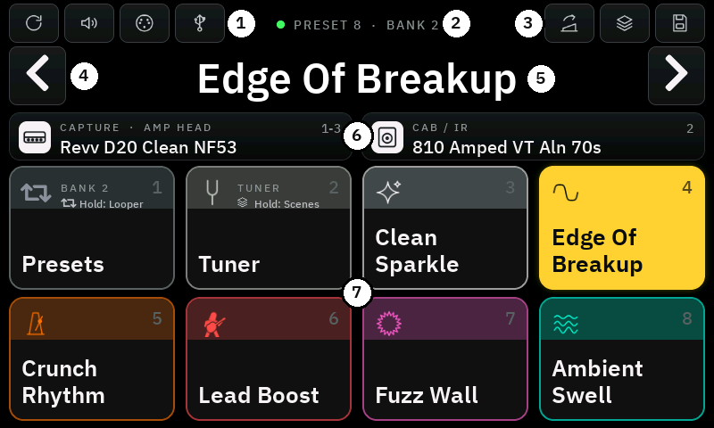

- **Kachel antippen** = ihren Fußschalter drücken. Eine Kachel leuchtet kurz auf, wenn ihr Fußschalter gedrückt wird.
- **Kacheln wie in der Signal Chain des Desktop-Editors**: das aktive Preset oder ein eingeschalteter Effekt ist in
  seiner Farbe **gefüllt**, alles andere dunkel mit **farbigem Rand** und der gedimmten Farbe hinter der oberen Zeile –
  auch von weiter weg gut zu unterscheiden.
  Alle Namen haben dieselbe Größe.
- **↻** (oben links) liest alles neu vom Nano: Preset-Namen, aktuelles Preset und die Library.
- Das **Lautsprecher**-Symbol daneben stellt die Capture-Lautstärke des aktuellen Presets ein, danach **MIDI** und **USB**.
- **Nach links / rechts wischen**: nächstes / vorheriges Preset.
- **Nach oben wischen – Gig-Ansicht**: die Kacheln füllen den Bildschirm mit größeren Namen, eine schmale Leiste
  oben zeigt Verbindung, Preset-Nummer, Bank, Preset-Name, ungespeicherte Änderungen und den Modus (PRESETS / SCENES / FX).
  **Nach unten wischen**: zurück.
- Rechts in der oberen Leiste: der **Pedal**-Knopf für das [Expression-Pedal](#expression-pedal), der
  **Szenen**-Knopf (Ebenen) und **Save**. Der Szenen-Knopf legt die [Szenen](#szenen) des aktuellen Presets auf die
  Kacheln 3–8, anstelle der Presets der Bank; nochmal tippen geht zurück. In der Gig-Ansicht macht ein Tipp auf den
  Modus oben rechts dasselbe.
- Der grüne Punkt zeigt die Bluetooth-Verbindung zum Nano; **Save** wird grün und neben dem Namen erscheint ein
  oranger Punkt, wenn das Preset ungespeicherte Änderungen hat. **MIDI** wird grün, solange ein Bluetooth-MIDI-Controller verbunden ist.
- Die **Capture-Karte** zeigt wie im Editor den Typ des Captures (Amp-Head, Combo, Amp + Cab, Cab, Pedal …).

## Fußschalter und Kacheln

| Schalter | Preset-Modus | FX-Modus |
|---|---|---|
| 1 | in den FX-Modus wechseln; **gehalten: Looper-Modus** | in den Preset-Modus wechseln; **gehalten: Looper-Modus** |
| 2 | Stimmgerät an/aus; **gehalten: Szenen ↔ Presets** | Stimmgerät an/aus; **gehalten: zu den Szenen** |
| 3–8 | die sechs Presets der aktuellen Bank | 3–7: Pre FX 1, Pre FX 2, Post FX 1–3 an/aus |
| 8 | (sechstes Preset) | Reverb: Mix Pos 1 ↔ Pos 2 oder Reverb A ↔ B |

Sind die Szenen gewählt (der Ebenen-Knopf oder Fußschalter 2 gehalten), sind die Schalter 3–8 die sechs
[Szenen](#szenen) des aktuellen Presets statt der Presets der Bank, und Fußschalter 1 wechselt zwischen FX-Modus und
Szenen. Die Fußschalter 1 und 2 schalten beim Loslassen (sie haben eine Halte-Funktion): Fußschalter 1 gehalten (0,6 s)
öffnet den Looper-Modus, Fußschalter 2 gehalten wechselt zwischen den Szenen und den Presets der Bank wie der
Szenen-Knopf (ist das Stimmgerät offen, schließt Fußschalter 2 es sofort). Die Kacheln 1 und 2 zeigen das unter
ihrer Beschriftung: *Hold: Looper* und *Hold: Scenes* (oder *Presets*).

Aktive Kacheln leuchten in voller Farbe, inaktive sind gedimmt. FX-Kacheln tragen die Farben der Effektkategorien.

## Lange drücken

| Wo | Was sich öffnet |
|---|---|
| Kachel 1 | **Looper-Modus** an / aus (wie Fußschalter 1 halten) |
| Kachel 2–8 im Looper-Modus | **Looper-Kachel**: Name, Farbe und Symbol dieses Schalters |
| Kachel 2 | **Learn** für Fußschalter 2 – und mit *Switch 1* in diesem Fenster für Fußschalter 1 |
| Preset-Kachel (3–8, Preset-Modus) | **Bank-Fenster**: Farbe, Symbol und Preset dieses Schalters; `DEFAULT` stellt das Standard-Preset her; `LEARN SWITCH` |
| Szenen-Kachel (3–8, Szenen) | **Szene**: Name, Farbe und welche Effekte an sind; `Remove` leert den Schalter |
| FX-Kachel (3–7, FX-Modus) | **FX-Editor**: Modell (auf den Kopf tippen), an/aus und alle Parameter |
| Kachel 8 (FX-Modus) | **Reverb-Fenster** mit den Reitern *MIX POS 1 / 2* und *2ND REVERB* |
| Preset-Name | **Umbenennen** mit Bildschirmtastatur (mindestens 4 Zeichen, eindeutig) |

## Eigene Bänke

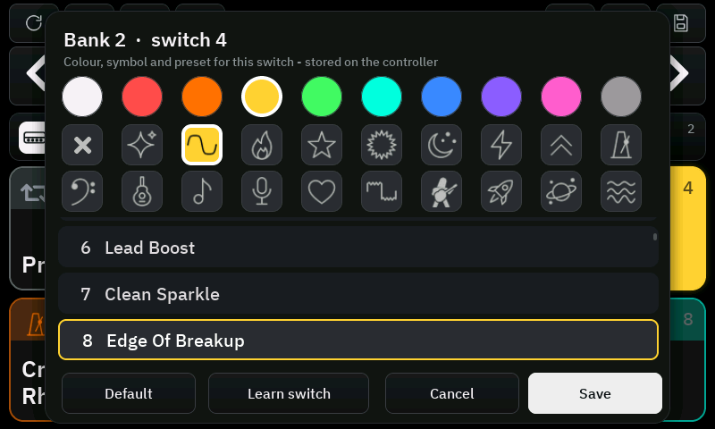

16 Bänke mit je sechs Schaltern. Ab Werk liegen in Bank 1 die Presets 1–6, in Bank 2 die Presets 7–12 und so weiter.
Lange auf eine Preset-Kachel drücken, dann beliebiges Preset, eine von zehn Farben und eines von 19 Symbolen wählen
(Clean, Edge, Drive, Solo, Fuzz, Atmospheric, Metal, Boost, Rhythm, Bass, Acoustic, Blues, Live, Favorite,
Fuzz Wave, Guitarist, Rocket, Space, Swell).
Die Bänke speichert der Controller, die Presets selbst bleiben auf dem Nano.

## Szenen

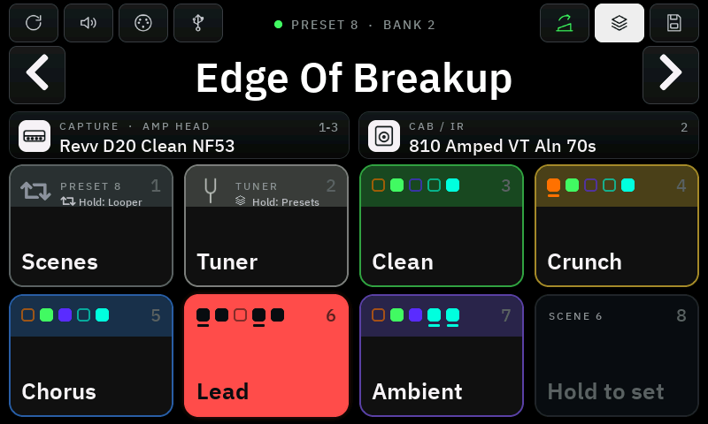 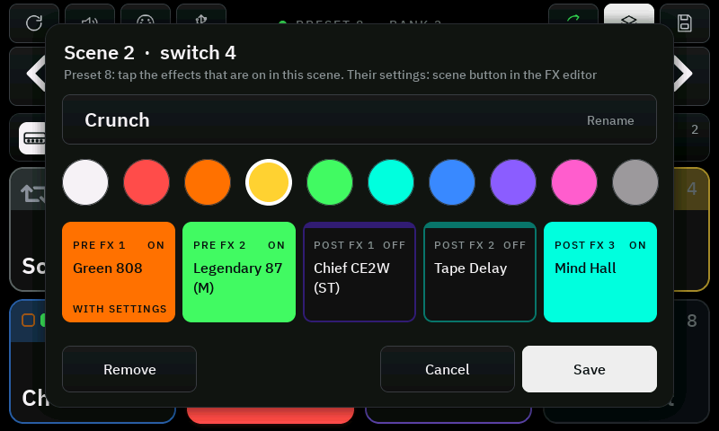

Eine Szene ist eine Einstellung der Effekte **innerhalb eines Presets**: welche der fünf FX-Slots an sind und auf
Wunsch, wie sie eingestellt sind. Jedes Preset kann sechs Szenen haben, auf den Fußschaltern 3–8. Der Schalter einer
Szene sendet nur, was sich ändert: Mehrere Effekte wechseln mit einem Tritt, und der Ton reißt nicht ab wie beim
Laden eines anderen Presets – zum Beispiel *Clean*, *Crunch* und *Lead* in einem Song.

- Der **Szenen-Knopf** (Ebenen, neben Save) zeigt die Szenen des aktuellen Presets auf den Kacheln 3–8; nochmal tippen bringt die Presets
  der Bank zurück. **Fußschalter 2 halten** macht dasselbe mit dem Fuß. Der Controller merkt sich die Wahl.
  Fußschalter 1 wechselt zwischen FX-Modus und dem, was davon
  gewählt ist.
- **Szene einrichten**: ihre Kachel halten. Name (15 Zeichen) und Farbe vergeben und die Effekte antippen, die in
  dieser Szene an sind – gefüllt = an, umrandet = aus. Eine leere Szene beginnt mit dem, was gerade an ist; man kann
  die Effekte also auch vorher im FX-Modus einstellen. **Save** speichert die Szene und schaltet auf sie um,
  **Remove** leert den Schalter.
- **Auf der Kachel** stehen fünf Quadrate für Pre FX 1–2 und Post FX 1–3 in den Farben ihrer Effekte: gefüllt = die
  Szene schaltet den Effekt an, umrandet = aus, ein Punkt = der Slot ist leer.
- **Es leuchtet** die Szene, deren Effekte gerade an sind. Wird ein Effekt von Hand geschaltet (FX-Modus, Schalter
  am Nano, Editor), leuchtet keine Szene, bis wieder eine getreten wird.
- Eine Szene schaltet den Effekt, der gerade im Slot liegt; Modelle ändert sie nicht. Leere Slots werden
  übersprungen.
- Ein Szenenwechsel markiert das Preset als geändert (oranger Punkt), wie jeder von Hand geschaltete Effekt;
  gespeichert werden muss nichts. Was direkt nach dem Laden eines Presets an ist, bestimmt weiterhin das auf dem Nano
  gespeicherte Preset – es also im Zustand der Szene speichern, mit der man beginnen will.
- Szenen liegen auf dem Controller, pro Preset-Nummer. Über Bluetooth-MIDI wählt CC 60 Szenen oder Presets.

### Einstellungen eines Effekts pro Szene

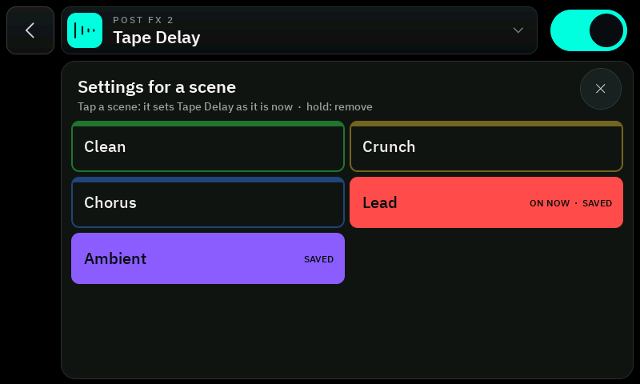

Eine Szene kann auch die Werte eines Effekts setzen – mehr Delay und Gain in *Lead* als in *Crunch*:

1. Den Effekt im [FX-Editor](#fx-editor) öffnen (er muss an sein) und so einstellen, wie die Szene klingen soll.
2. Auf den **Szenen-Knopf** am Ende der FX-Preset-Leiste tippen und dann auf die Szene. Sie trägt jetzt diese
   Einstellungen für diesen Effekt und sendet sie bei jedem Tritt auf ihren Fußschalter.
3. Dasselbe für die anderen Szenen, die diesen Effekt setzen sollen – vorher die Werte ändern, wo sie abweichen sollen.

- In der Liste ist eine Szene **gefüllt**, wenn sie Einstellungen für diesen Effekt trägt; *ON NOW* markiert die
  Szene, deren Effekte gerade an sind. Eine gefüllte Szene **antippen** ersetzt ihre Einstellungen durch die
  aktuellen, **halten** entfernt sie.
- Der Szenen-Knopf zeigt, wie viele Szenen Einstellungen für den Effekt tragen, und ist gefüllt, solange die
  laufende Szene dazugehört. Auf der Kachel einer Szene sagt ein kleiner Strich unter dem Quadrat des Effekts
  dasselbe, in ihrem Fenster *WITH SETTINGS*.
- **Eine Szene setzt nur, was für sie gespeichert wurde.** Ein Effekt, für den sie keine Einstellungen hat, bleibt,
  wie er ist – auch so, wie ihn eine andere Szene hinterlassen hat. Sollen sich zwei Szenen in einem Effekt
  unterscheiden, seine Einstellungen in beiden speichern.
- Gesendet werden nur die Werte, die abweichen: Ein Szenenwechsel, der ein paar Werte ändert, ist so schnell wie
  einer, der nur schaltet. Ein Effekt, der angeht, bekommt zuerst seine Werte.
- Die Einstellungen gehören zum Modell. Liegt ein anderes Modell im Slot, bleiben sie erhalten, werden aber nicht gesendet.

## Expression-Pedal

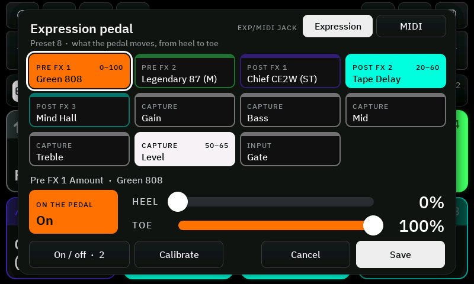 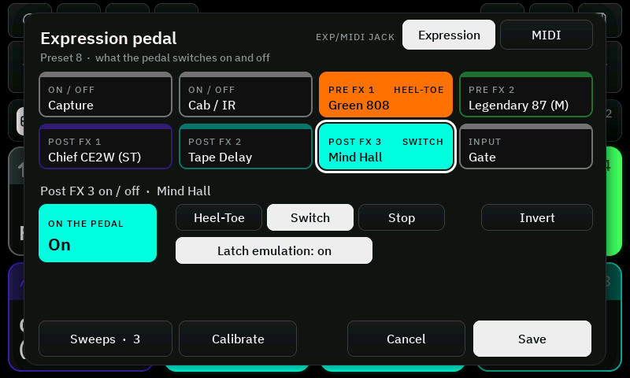

Der **Pedal-Knopf** in der oberen Leiste öffnet, was das Expression-Pedal des Nano im aktuellen Preset bewegt. Es
sind dieselben Zuweisungen wie in der Cortex-Cloud-App und im Expression-Fenster des Editors: Sie gehören zum Preset
des Nano. Das Symbol des Knopfs ist grün, solange das Pedal im Preset etwas tut.

- Elf Werte können dem Pedal folgen: der **Amount** jedes der fünf Effekte (der AMOUNT-Regler – die Stellung eines
  Wah, der Mix eines Reverbs …), Gain, Bass, Mid, Treble und Level des Captures und das Input-Gate. Ein Feld ist
  **gefüllt**, solange sein Wert auf dem Pedal liegt, und zeigt seinen Bereich.
- **Feld antippen** wählt es. **On the pedal** schaltet seine Zuweisung; **HEEL** und **TOE** sind die Werte an den
  beiden Enden des Pedalwegs (ein Fersenwert über dem Spitzenwert dreht die Richtung um). Einen Regler bewegen legt
  den Wert aufs Pedal.
- **Save** schreibt die Zuweisungen sofort ins Preset des Nano – das Preset selbst muss nicht gespeichert werden –
  und liest sie zur Kontrolle zurück. **Cancel** verwirft die Änderungen.
- **On / off** (unten links) öffnet die zweite Seite: was das Pedal ein- und ausschaltet – Capture, Cab, jeden
  Effekt, das Input-Gate. Feld wählen, dann die Art, benannt wie in der Cortex-Cloud-App: **Heel-Toe** und **Stop**
  mit einer Verzögerung (0–2000 ms), **Switch** für einen Fußschalter an der Buchse – mit **Latch Emulation** für
  einen, der nur Kontakt gibt, solange er gedrückt ist. **Invert** dreht Heel-Toe und Switch um. Der Knopf heißt
  dann *Sweeps* und führt zurück; Save schreibt beide Seiten.
- **Calibrate** (wenn die Buchse auf *Expression* steht) bringt dem Nano den Weg des Pedals bei: Nach *Start*
  vergisst der Nano seine Kalibrierung und meldet, wo das Pedal steht. Das Pedal ein paar Mal über den ganzen Weg
  bewegen und *Save* tippen – die niedrigste und die höchste Stellung werden im Nano gespeichert. *Cancel* lässt das
  Pedal unkalibriert.
- Für ein Wah: ein Wah-Modell auf Pre FX 1 oder 2 legen, das Fenster öffnen, den Slot wählen und *On the pedal*
  einschalten.
- **EXP/MIDI JACK** (oben rechts): was die EXP/MIDI-Buchse des Nano annimmt – ein **Expression**-Pedal oder
  TRS-**MIDI**, nicht beides. Es ist die Einstellung des Nano selbst (*EXP/MIDI Input Behavior* in der
  Cortex-Cloud-App) und gilt für alle Presets. Gefüllt ist, was der Nano meldet; ein Tipp auf die andere Seite fragt
  nach, schaltet um und prüft. Steht die Buchse auf MIDI, übernimmt CC 1 die Rolle des Pedals (0 = Ferse,
  127 = Spitze). Der Nano setzt seine MIDI-Clock-Quelle zurück, wenn die Buchse MIDI verlässt – nach dem
  Zurückschalten in der App nachsehen.

## Capture und Cab/IR

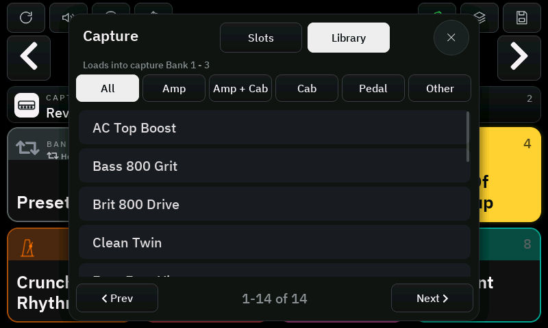 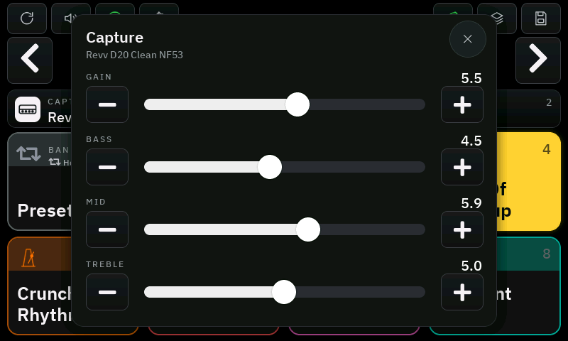

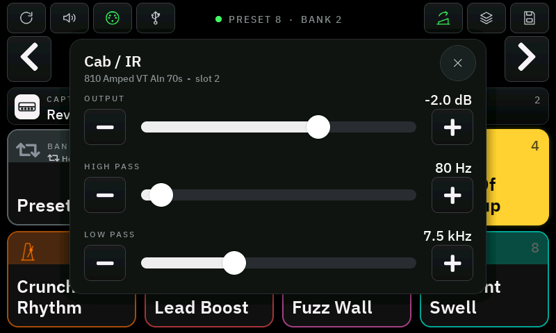 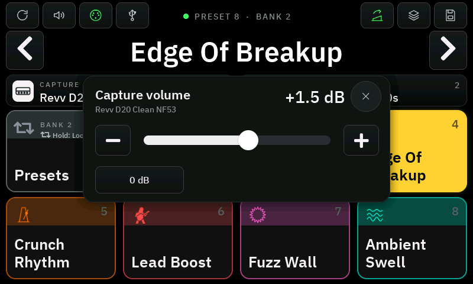

Auf das Feld CAPTURE oder CAB / IR tippen. **SLOTS** zeigt die 25 Capture-Slots (5 Bänke × 5) bzw. die 5 Cab-Slots,
**LIBRARY** alle auf dem Nano gespeicherten Captures bzw. IRs mit Kategorie-Filtern (AMP = Topteil oder Combo, AMP+CAB, CAB, PEDAL, OTHER).
Ein Library-Eintrag wird nach einer Rückfrage in den aktiven Slot geladen.

**Capture-Lautstärke**: **VOL** im Preset-Feld, −24 dB bis +12 dB (**0 dB** setzt zurück). **Capture-Klang**: lange
auf das CAPTURE-Feld drücken – **GAIN**, **BASS**, **MID** und **TREBLE** des Captures, 0–10. **Cab-Einstellungen**: lange auf das CAB / IR-Feld drücken – **OUTPUT** (−96 dB bis +12 dB),
**HIGH PASS** (20–800 Hz) und **LOW PASS** (1–20 kHz) des aktiven Cabs, beim Öffnen vom Nano gelesen.
Alles gehört zum Preset: Änderungen sind sofort zu hören, **SAVE** behält sie.

## FX-Editor

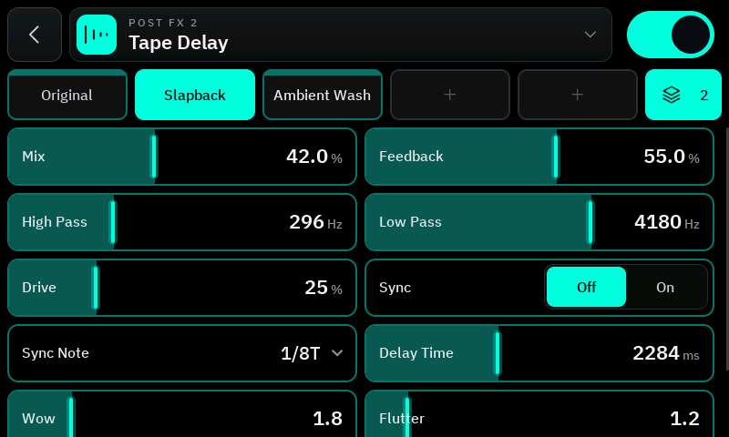 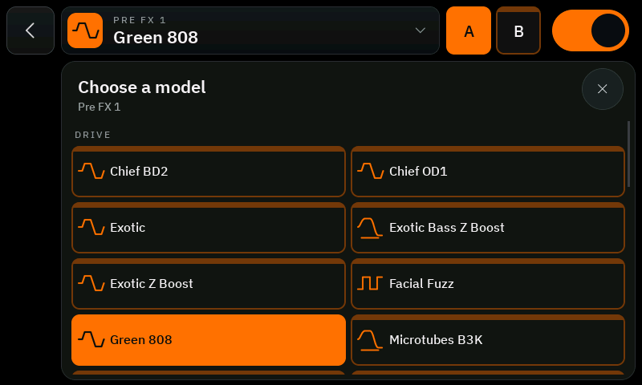

Der Kopf zeigt das Symbol des Effekts – in seiner Farbe gefüllt, wenn er an ist, nur umrandet, wenn er aus ist –
dazu Slot und Modell. Antippen öffnet die Modellauswahl, nach Art gruppiert (Drive, EQ & Utility, Wah & Filter …);
der große Schalter rechts schaltet den Effekt an oder aus.

Die Parameter sind Balken in zwei Spalten, bis zum Wert in der Effektfarbe gefüllt. **Seitlich wischen** auf einem
Balken ändert ihn: Er folgt dem Finger ab seinem aktuellen Wert, Antippen oder Scrollen lässt also keinen Wert
springen. Hoch und runter scrollt die Liste. Einstellungen mit zwei oder drei Möglichkeiten (*Off | On*, *Sync* …)
werden angetippt, längere Listen (*Sync Note* …) öffnen eine Auswahl.

Änderungen gehen schon beim Bewegen eines Reglers an den Nano. Der Nano meldet Parameterwerte nur von
eingeschalteten Effekten – einen Effekt also einschalten, um seine Werte zu sehen und zu ändern. **SAVE** im
Preset-Feld speichert das Preset auf dem Nano.

**FX-Presets** (die Leiste über den Reglern): *Original* und vier benannte Einstellungen pro Effektmodell,
gespeichert auf dem Controller und in jedem Preset und Slot mit diesem Modell nutzbar; leere Plätze zeigen **+**.

- **Halten** auf einem Platz: Die Tastatur öffnet sich, und die aktuellen Einstellungen werden unter dem
  eingegebenen Namen gespeichert. Ein leerer Name löscht den Platz.
- **Antippen** lädt die Einstellungen sofort.
- **Original** holt die Einstellungen zurück, die der Effekt beim Öffnen des Editors hatte. Direkt nach der Wahl
  eines neuen Modells sind das seine Grundeinstellungen.

Geladene Einstellungen zählen als Änderung am Nano-Preset: **SAVE** behält sie dort.

Der **Szenen-Knopf** am Ende der Leiste speichert die aktuellen Einstellungen für eine
[Szene](#einstellungen-eines-effekts-pro-szene) des Presets.

## Reverb-Schalter (Fußschalter 8)

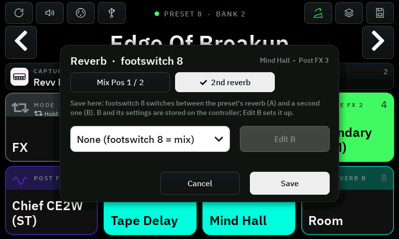

Das Fenster hat zwei Reiter, einen für jede Funktion von Fußschalter 8. **Der Reiter, der beim Tippen auf SAVE
vorne ist, bestimmt, was der Schalter ab dann tut**; der gerade verwendete trägt einen Haken.

- **MIX POS 1 / 2**: Fußschalter 8 setzt den Mix des Reverbs auf Pos 1 oder Pos 2. Beim Bewegen eines Reglers
  hörst du den Mix; **SAVE** speichert beide Werte auf dem Controller, für dieses Preset. Das Expression-Pedal des
  Nano ist daran nicht beteiligt und bleibt frei für ein Wah oder anderes.
- **Presets, die vor 1.8 eingerichtet wurden**, hatten Pos 1 und Pos 2 als Fersen- und Spitzenwert der
  Expression-Einstellung des Presets für das Reverb („Post FX 3 Amount“) auf dem Nano. Der Controller übernimmt sie,
  wenn er so ein Preset das erste Mal lädt. Die Einstellung selbst steht weiter im Preset des Nano, ein
  Expression-Pedal würde das Reverb also noch bewegen: **FREE PEDAL** in diesem Fenster nimmt sie aus dem Preset
  (die anderen Expression-Einstellungen bleiben, wie sie sind, der Schalter behält seine Positionen). Den Knopf gibt
  es nur, solange das Reverb auf dem Pedal liegt.
- **2ND REVERB**: ein zweites Reverb (B) für dieses Preset wählen. Fußschalter 8 wechselt dann zwischen dem
  Reverb des Presets (A) und B. Der Nano hat nur einen Reverb-Platz, deshalb tauscht der Controller das Modell aus
  und schickt die gespeicherten Werte (dauert etwa eine halbe Sekunde). Kachel 8 zeigt Reverb B und leuchtet,
  solange es läuft; Kachel 7 zeigt das Reverb, das gerade im Slot ist. **EDIT B** lädt B und öffnet den FX-Editor
  zum Einstellen. Reverb B speichert der Controller, pro Preset. Wird das Preset gespeichert, während B läuft,
  wird B zum Reverb des Presets.
  Auf dem Reiter *MIX POS 1 / 2* gespeichert, ist Fußschalter 8 wieder der Mix-Schalter, und Reverb B bleibt mit
  seinen Einstellungen für später gespeichert; *None* in der Liste entfernt es.

## Zweiter Effekt auf Pre FX 1 (Fußschalter 3)

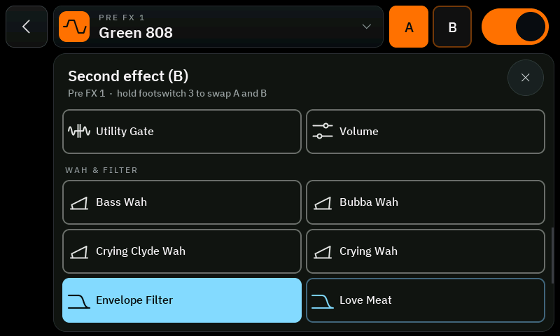

Lange auf die Pre-FX-1-Kachel drücken, dann **+B** (neben dem Modell im FX-Editor): einen zweiten Effekt (B) für
dieses Preset wählen, zum Beispiel das Envelope Filter als Auto-Wah neben einem Drive. **A | B** zeigt dann, welcher
läuft: den anderen antippen tauscht sofort, den laufenden antippen wählt einen anderen zweiten Effekt oder *None*.
Dann Fußschalter 3 im FX-Modus:

- **kurz drücken**: den Effekt im Slot an / aus (schaltet beim Loslassen)
- **halten** (0,6 s): A ↔ B wechseln – der Effekt bleibt an oder aus, wie er war

Die Kachel zeigt *Pre FX 1 A* oder *Pre FX 1 B* und darunter den anderen Effekt (⇄ Name). Der Nano hat pro Slot ein Modell, deshalb tauscht der Controller
das Modell und schickt die gespeicherten Werte des anderen Effekts: das dauert etwa eine halbe Sekunde mit einem
kurzen Aussetzer. Ohne Aussetzer geht es, wenn der zweite Effekt in einem freien Slot liegt und nur an- und
ausgeschaltet wird. B wird im FX-Editor eingestellt, während es läuft, und auf dem Controller pro Preset gespeichert
(MIDI: CC 58). Die Einstellungen von A merkt sich der Controller ebenfalls, gelesen immer wenn A an ist. Nur wenn A
seit dem Einrichten von B nie an war, schaltet der erste Wechsel A kurz an, um sie zu lesen.

## Stimmgerät

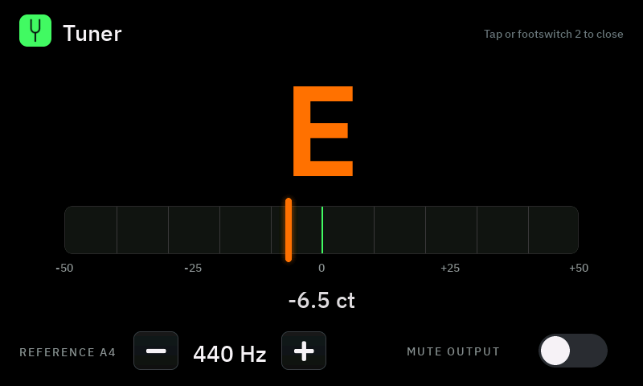

Fußschalter 2 oder die Kachel TUNER. Sieht aus wie der Tuner im Desktop-Editor: große Note in der Stimmfarbe (grün =
gestimmt, orange = daneben), eine Skala mit einem Strich alle 10 Cent und eine leuchtende Nadel, dazu die Abweichung
in Cent. Unten stellt **Reference A4** den Kammerton ein (400–480 Hz, − / + gedrückt halten läuft durch), und
**Mute output** schaltet den Nano beim Stimmen stumm. Bildschirm antippen oder Fußschalter 2 erneut drücken zum Schließen.

## USB-Audio-Lautstärke

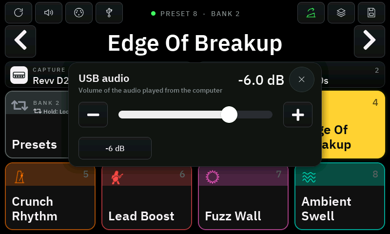

**USB** im Preset-Feld: Lautstärke des Audios, das der Computer über USB abspielt, −40 dB (OFF) bis 0 dB,
wie in der offiziellen App. Der Wert wird jedes Mal frisch vom Nano gelesen.

## Bluetooth-MIDI

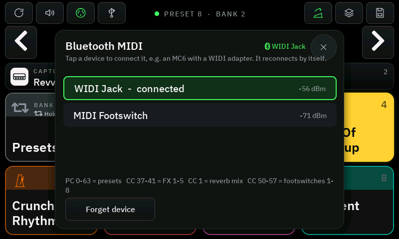

**MIDI** im Preset-Feld öffnet die Geräteliste. Sie zeigt Bluetooth-MIDI-Geräte in der Nähe – zum Beispiel einen
CME-WIDI-Adapter an der MIDI-Buchse eines Morningstar MC6 oder einen
Bluetooth-MIDI-Fußschalter. Antippen verbindet; der Controller merkt sich das Gerät und verbindet sich wieder von
selbst, sobald es eingeschaltet ist. **FORGET DEVICE** trennt und vergisst es. Der Nano bleibt dabei verbunden.

Der Controller versteht dieselben Befehle wie der Nano selbst über USB-MIDI, auf allen MIDI-Kanälen. Bänke für den
Nano (zum Beispiel aus dem MC6-Export des Nano Cortex Editors) funktionieren also auch über Bluetooth:

| Befehl | Wirkung |
|---|---|
| Program Change 0–63 | Preset 1–64 |
| CC 37–41 | FX-Slot 1–5 (Pre FX 1, Pre FX 2, Post FX 1–3): Wert 64–127 an, 0–63 aus |
| CC 1 | Expression: Reverb-Mix von Pos 1 (0) bis Pos 2 (127) |
| CC 50–57, Wert 64–127 | Fußschalter 1–8 drücken (Modus, Stimmgerät, Presets oder FX, Reverb-Schalter) |
| CC 58, Wert 64–127 | Fußschalter 3 halten: Pre FX 1 wechselt zum zweiten Effekt und zurück |
| CC 59 | Looper-Modus: Wert 64–127 an, 0–63 aus |
| CC 60 | Fußschalter 3–8: Wert 64–127 [Szenen](#szenen) des Presets, 0–63 Presets der Bank |

Ein MIDI-Kabeleingang ist auf diesem Board ohne zusätzliche Hardware nicht möglich; dafür einen
Bluetooth-MIDI-Adapter verwenden.

## Looper-Modus (eine Looper-App auf dem Telefon)

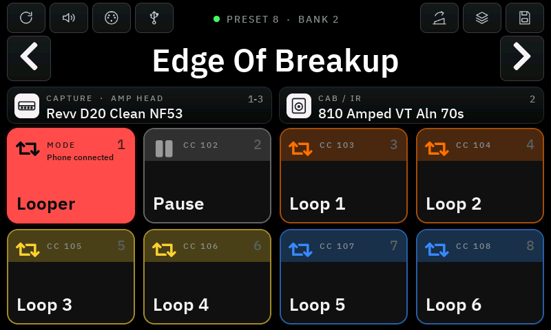 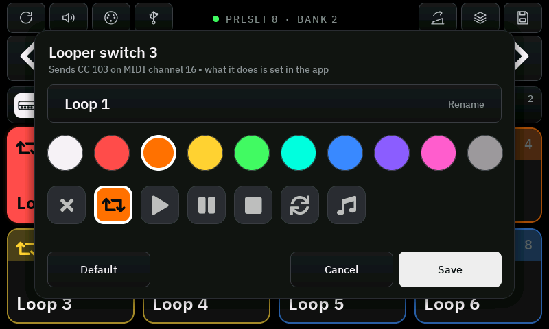

Der Controller kann der Fußcontroller einer Looper-App sein, zum Beispiel **Loopy Pro** auf iPhone oder iPad. Das
Telefon spielt über den Nano: Am USB-C-Anschluss ist der Nano das Audio-Interface des Telefons – die Gitarre geht
in die App, Loops (und Backing Tracks) kommen aus dem Nano. Ihre Lautstärke ist die *USB-Audio-Lautstärke* (siehe
oben). Die Fußschalter erreichen die App per **Bluetooth-MIDI**: Der Controller ist ein Bluetooth-MIDI-Gerät mit
dem Namen **„Nano Cortex Controller“**.

1. In Loopy Pro im Hauptmenü **Bluetooth Devices** öffnen und *Nano Cortex Controller* wählen. Der Controller zeigt
   *Phone connected* und wie oft MIDI ausgetauscht wird (auf einem iPhone alle 11,25 oder 15 ms).
2. **Fußschalter 1 halten** (0,6 s) oder lange auf Kachel 1 drücken: Die Kacheln werden zu den Schaltern des
   Loopers. Jeder Tritt auf Fußschalter 1 verlässt den Modus wieder; FX und Presets bleiben, wie sie waren.
3. In Loopy Pro **MIDI Learn** wählen, antippen, was ein Schalter tun soll (für einen Loop: *Abspielen/Stoppen*
   mit *Aufnahme, wenn leer*), und diesen Fußschalter treten. Jeden Schalter nur einmal belegen: Zwei Belegungen auf
   demselben Loop heben sich gegenseitig auf.

| Fußschalter | Sendet (MIDI-Kanal 16) | Kachel (ab Werk) |
|---|---|---|
| 2 | CC 102 | Pause |
| 3–8 | CC 103–108 | Loop 1–6 |

**Eigene Namen**: Langes Drücken auf eine Kachel im Looper-Modus öffnet ihr Fenster – Name (Tastatur), Farbe und
Symbol, gespeichert auf dem Controller; *Default* stellt die oben gezeigte Kachel wieder her. Kachel 1 zeigt, was der
letzte Tritt gesendet hat (*Sent CC 103*) – hilfreich beim Belegen eines Schalters in der App.

Ab Werk zeigen die Kacheln die Loops in drei Farbpaaren, wie ein zweispaltiges Loopy-Pro-Projekt. Was ein Schalter
tut, bestimmt die App.

Ein Fußschalter sendet beim Treten den Wert 127 und beim Loslassen 0; so funktionieren die Auslöser *Hold*
und *Double Tap* der App. Antippen einer Kachel sendet einen kurzen Tritt. Im Looper-Modus geht ein Tritt 2–4 ms nach
dem Schließen des Kontakts hinaus; über Bluetooth wartet er dann auf den nächsten Austausch mit dem Telefon –
höchstens das beim Verbinden angezeigte Intervall. Bei Loops, die auf dem Takt beginnen und enden (Quantisierung der
App), spielt das keine Rolle; ein frei aufgenommener erster Loop kann um so viel länger oder kürzer werden.

Telefon und Nano Cortex Editor können gleichzeitig verbunden sein. Was die App zurückschickt (Rückmeldung für die
Lämpchen eines Controllers), steht vorerst im seriellen Protokoll.

## Nano Cortex Editor über den Controller

Der Nano erlaubt nur eine Bluetooth-Verbindung. Ist der Controller mit dem Nano verbunden, bietet er sich selbst als
**„Nano Cortex Controller“** mit demselben Bluetooth-Dienst wie der Nano an. Der
[Nano Cortex Editor](https://github.com/DrD85/nano-cortex-editor) verbindet sich dann mit dem Controller:
**App ↔ Controller ↔ Nano**. Die Mac-App wählt ihn automatisch; im Browser „Nano Cortex Controller“ auswählen.
Ohne Controller (oder bevor er verbunden ist) verbindet sich die App wie bisher direkt mit dem Nano.

- Alles, was die App schickt, geht an den Nano weiter; Antworten auf Anfragen der App gehen an die App, Antworten
  auf Anfragen des Controllers bleiben im Controller, Meldungen, die der Nano von sich aus schickt, gehen an beide.
- Änderungen in der App erscheinen kurz danach am Controller; Änderungen am Controller (Fußschalter, Touch, MIDI)
  lassen die App das Preset neu lesen, wie nach einem Wechsel am Pedal.
- Solange die App verbunden ist, steht **APP** in der Statuszeile.

## Fußschalter-Learn

Lange auf Kachel 2 drücken (Fußschalter 2; **Switch 1** im Fenster lernt stattdessen Fußschalter 1) oder **LEARN SWITCH**
im Bank-Fenster. Dann innerhalb von 15 Sekunden den
Fußschalter drücken, der diese Funktion bekommen soll. Hatte er eine andere Funktion, werden die beiden getauscht.
**DEFAULT ORDER** stellt die Standard-Reihenfolge wieder her.

## Fußschalter

Die Fußschalter liest ein **SX1509**-I/O-Expander (zum Beispiel die SparkFun-Platine), wie beim
[TonexOneController](https://github.com/Builty/TonexOneController).

- Den SX1509 an den **I2C**-Bus des Boards anschließen: SDA = GPIO 8, SCL = GPIO 9, 3,3 V und GND
  (den passenden Stecker deines Boards zeigt das Waveshare-Wiki).
- Die Adresse des SX1509 auf **0x71** (oder 0x70) stellen. 0x3E/0x3F belegt der I/O-Expander des Boards selbst.
- Jeden Fußschalter (Taster, Schließer) zwischen einen I/O-Pin des SX1509 und **GND** legen. Die internen
  Pull-ups werden genutzt, Widerstände sind nicht nötig.
- Standard-Reihenfolge: Schalter 1–8 an den SX1509-Pins **11, 10, 0, 1, 2, 3, 8, 9**. Andere Pins gehen auch –
  einfach per Fußschalter-Learn zuordnen.

Ohne SX1509 funktioniert der Controller nur mit dem Touchscreen.

## Was wo gespeichert ist

| Auf dem Nano | Auf dem Controller |
|---|---|
| Presets, Namen, Captures, Cabs, FX und ihre Werte, Expression-Einstellungen, USB-Lautstärke | eigene Bänke (Preset, Farbe, Symbol), Szenen, Reverb-Mix Pos 1 / Pos 2, Fußschalter-Reihenfolge, zweite Reverbs, das Bluetooth-MIDI-Gerät |
